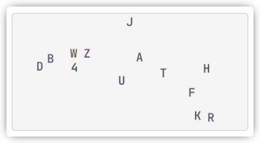
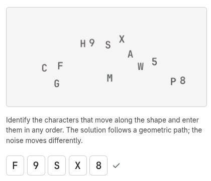
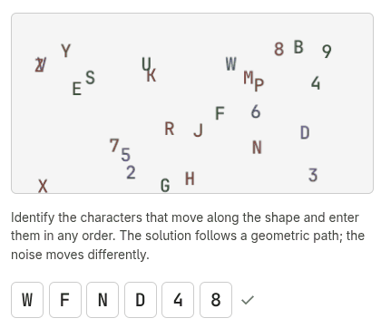
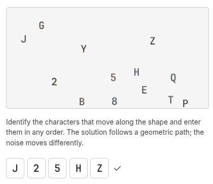

# Movement-Based Captcha Prototype

A proof-of-concept captcha that relies on **movement** rather than static distortion or objects recognition to distinguish humans from AI vision tools.

## Why

Static captchas (twisted text, image grids, reCAPTCHA challenges) are increasingly solved by vision models (OCR, GPT-4V, Claude, etc.). This prototype explores a different angle: **temporal reasoning**. Users must track which characters move along a geometric path over time, while decoy characters move differently. This combination of motion and spatial awareness is harder/more expensive for frame-by-frame AI analysis.

## How

- Solution letters and noise characters are scattered in a rectangle.
- Solution characters move along a shared shape (circle, square, triangle, etc.).
- Noise characters move according to a separate pattern (random jitter, square, circle, etc.).
- The user observes, identifies the solution characters by their movement signature, and types them in any order.

## Examples

A static frame taken independantly would be useless:

But as soon as you get some movement, the solution becomes visible:

## Run

Open `index.html` in a browser. No server or build step required.

## Status / Limitations

- **Client-side only** – Solution is visible in memory; a proper implementation would require server-side generation and validation.
- **No accessibility review** – Motion-based challenges are inherently difficult for users with vestibular disorders, seizure susceptibility, or screen readers. A live captcha would need alternatives (e.g. reduced motion, audio fallback).
- **Not peer reviewed** – Security and usability have not been evaluated by third parties.

## Disclaimer

This prototype was created with the assistance of generative AI (Composer 1.5).